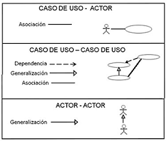

# Ingeniería de Software I - Casos de Uso

## Apunte Teórico

### De Historias de Usuario a Casos de Uso

#### La Evolución del Análisis de Requerimientos

Los **Casos de Uso** son la evolución natural de las **Historias de Usuario** en el proceso de análisis de requerimientos:

- **Historias de Usuario**: Capturan el "¿qué?" y "¿para qué?" desde la perspectiva del usuario
- **Casos de Uso**: Detallan el "¿cómo?" a través de interacciones específicas entre actores y sistema

#### Del Formato Ágil al Detalle Técnico

**Historia de Usuario**:

> "Como usuario registrado, quiero reproducir películas para disfrutar del contenido completo"

**Se transforma en Caso de Uso**:

- **Actor**: Usuario Registrado
- **Precondiciones**: Usuario autenticado
- **Curso Normal**: Secuencia detallada de pasos
- **Cursos Alternos**: Manejo de excepciones (película exclusiva, falta de pago)

### Definiciones Fundamentales

#### ¿Qué son los Casos de Uso?

Los **Casos de Uso** representan un proceso de modelado del problema en términos de los eventos que interactúan entre los usuarios y el sistema. Es una técnica fundamental en el desarrollo centrado en el usuario que **profundiza y detalla** las necesidades expresadas inicialmente en las Historias de Usuario.

#### Desarrollo Centrado en el Usuario

El **desarrollo centrado en el usuario** es un enfoque de diseño y desarrollo de software que pone las necesidades, comportamientos y experiencias del usuario final en el centro del proceso de desarrollo. Se enfoca en entender cómo los usuarios interactúan con el sistema para crear soluciones que satisfagan sus necesidades reales.

### Elementos Principales

#### Actor

- **Definición**: Toda entidad que interactúa directamente con el sistema
- **Características**:
  - Puede ser una persona, otro sistema o una entidad externa
  - Se representa con un ícono de figura humana en el diagrama
  - No forma parte del sistema, sino que interactúa con él

#### Caso de Uso

- **Definición**: Representa una funcionalidad en términos de la interacción del usuario
- **Características**:
  - Se representa con una elipse
  - El nombre debe ser breve y descriptivo (comenzar con un verbo)
  - Describe una funcionalidad específica del sistema

#### Diagrama de Casos de Uso

- **Definición**: Ilustra las relaciones entre los Casos de Uso y los actores
- **Propósito**: Proporcionar una vista general de las funcionalidades del sistema y sus interacciones

#### Escenarios

- **Definición**: Descripción detallada de cada Caso de Uso para llevar a cabo la funcionalidad
- **Propósito**: Especificar paso a paso cómo se ejecuta cada caso de uso

### Proceso de Modelado

1. **Partir de las Historias de Usuario**

   - Revisar las historias de usuario identificadas
   - Agrupar historias relacionadas

2. **Identificar los actores**

   - Buscar todas las entidades que interactúan con el sistema
   - Considerar personas, sistemas externos, dispositivos
   - Incluir actores especiales como "Tiempo"

3. **Identificar los casos de uso**

   - Determinar las funcionalidades que debe proveer el sistema
   - Descomponer historias de usuario complejas
   - Nombrarlos con verbos descriptivos

4. **Construir el diagrama**

   - Relacionar actores con casos de uso
   - Establecer relaciones entre casos de uso

5. **Realizar los escenarios**
   - Describir detalladamente cada caso de uso

### Relaciones en el Diagrama

#### Relación de Asociación

- **Descripción**: Conexión simple entre actor y caso de uso
- **Representación**: Línea continua
- **Uso**: Cuando un actor participa en un caso de uso

#### Relación de Extensión (<<extend>>)

- **Descripción**: Un caso de uso extiende a otro bajo ciertas condiciones
- **Representación**: Flecha punteada con etiqueta <<extend>>
- **Uso**: Para funcionalidades opcionales o condicionales

#### Relación de Inclusión (<<include>> o <<uses>>)

- **Descripción**: Un caso de uso incluye obligatoriamente a otro
- **Representación**: Flecha punteada con etiqueta <<include>>
- **Uso**: Para funcionalidades comunes reutilizables

#### Relación de Herencia

- **Descripción**: Especialización entre actores o casos de uso
- **Representación**: Flecha continua con punta triangular
- **Uso**: Para mostrar jerarquías

### Estructura del Escenario

#### Elementos Obligatorios:

**Nombre del caso de uso**: Nombre breve y descriptivo (comenzar con un verbo)

**Descripción**: Comentario general del propósito del CU

**Actores**: Una o más entidades, como figuran en el diagrama

**Precondiciones**: Condición necesaria que se asume como verdadera antes de comenzar a ejecutar el CU. En general, es la postcondición de otro CU

**Curso Normal**:

- Secuencia de pasos numerada que reflejan la interacción entre el actor y el sistema
- Se divide en dos columnas:
  - Acciones del Actor
  - Acciones del Sistema

**Curso Alterno**: Pasos alternativos al curso normal. Pueden ser del actor o del sistema. Siempre se debe especificar si el CU termina o retoma a un paso del curso normal

**Postcondición**: Condición relacionada con el sistema que se da por verdadera luego de ejecutado el curso normal

### Actor Especial: Tiempo

Los **Casos de Uso** introducen un concepto importante que no aparece en las Historias de Usuario: **el actor Tiempo**.

- **Definición**: Representa procesos automáticos disparados por eventos temporales
- **Características**:
  - La interacción no es recíproca
  - El tiempo actúa únicamente como disparador
  - El sistema responde ejecutando un proceso automático
- **Ejemplo**: "Publicar estrenos" que se ejecuta semanalmente

### Beneficios de Modelar con Casos de Uso

1. **Comunicación mejorada**: Facilita la comunicación entre desarrolladores, analistas y usuarios finales
2. **Enfoque en el usuario**: Mantiene el foco en las necesidades del usuario
3. **Organización clara**: Estructura las funcionalidades del sistema de manera comprensible
4. **Base para pruebas**: Los escenarios sirven como base para crear casos de prueba
5. **Documentación**: Proporciona documentación clara de los requerimientos
6. **Planificación**: Ayuda en la estimación de esfuerzos y planificación del proyecto
7. **Validación**: Permite validar requerimientos con los stakeholders
8. **Trazabilidad**: Facilita el seguimiento desde requerimientos hasta implementación
9. **Detalle técnico**: Proporciona el nivel de detalle necesario para el desarrollo

### Consejos para Escribir Buenos Casos de Uso

1. **Partir de historias de usuario validadas**: Usar las historias como base para asegurar valor de negocio
2. **Nombrar con verbos**: Los casos de uso deben comenzar con un verbo (Ej: "Registrar usuario", "Procesar pago")
3. **Ser específicos**: Evitar ambigüedades en las descripciones
4. **Mantener granularidad adecuada**: No muy generales ni muy específicos
5. **Incluir cursos alternos**: Considerar escenarios de error y excepciones
6. **Usar lenguaje del dominio**: Emplear términos que entienda el cliente
7. **Ser consistentes**: Mantener el mismo nivel de detalle en todos los casos de uso
8. **Validar con usuarios**: Confirmar que los escenarios reflejan correctamente las necesidades

### Cuándo Usar Cada Técnica

#### Usar Historias de Usuario cuando:

- Se necesita comunicación rápida con stakeholders
- Se está en fases tempranas de análisis
- Se trabaja con metodologías ágiles
- Se requiere priorización por valor de negocio

#### Usar Casos de Uso cuando:

- Se necesita detalle técnico para el desarrollo
- Se requiere documentación formal
- Se deben especificar interacciones complejas
- Se necesita base para casos de prueba detallados

### Ejemplo de Evolución: Historia de Usuario → Caso de Uso

**Historia de Usuario Original**:

> "Como usuario visitante, quiero ver adelantos de películas para conocer el contenido antes de decidir registrarme"

**Caso de Uso Resultante**:

**Nombre**: Ver Adelanto  
**Descripción**: Este caso de uso describe el evento en el que un usuario visualiza el adelanto de una película  
**Actor**: Usuario Visitante  
**Precondiciones**: ---

**Curso Normal**:
| Acciones del Actor | Acciones del Sistema |
|-------------------|---------------------|
| Paso 1: el usuario visitante selecciona la opción Ver adelanto | Paso 2: el sistema muestra un listado de los títulos de las películas de la semana |
| Paso 3: el usuario visitante selecciona una de las películas de la lista | Paso 4: el sistema reproduce el adelanto seleccionado |

**Curso Alterno**: ---  
**Postcondición**: El adelanto de una película fue reproducido

Esta evolución muestra cómo una historia de usuario simple se convierte en un caso de uso detallado que especifica exactamente cómo debe comportarse el sistema.

Esta evolución muestra cómo una historia de usuario simple se convierte en un caso de uso detallado que especifica exactamente cómo debe comportarse el sistema.

---

## Aclaraciones Importantes de los Profesores

### Conceptos Fundamentales para Corrección

#### Sobre los Actores
- **Definición operativa**: Los actores son entidades que interactúan directamente con el sistema
- **Tipos de actores**: No necesariamente son personas, pueden ser:
  - Servidores externos
  - Funciones automatizadas
  - Actor especial "Tiempo"
- **Regla crítica**: **DOS ACTORES NUNCA ACTIVAN EL MISMO CASO DE USO**
  - Si dos actores interactúan con el mismo caso de uso, debe generalizarse a un único actor común

#### Sobre los Casos de Uso
- **Principio básico**: Cada caso de uso representa una funcionalidad específica del sistema
- **Organización**: Un caso de uso por planilla (escenario)
- **Propósito**: Mostrar la reacción del sistema ante las acciones del usuario

### Diagramas y Representaciones

#### Tipos de Conexiones
- **Línea continua (Asociación)**: 
  - No hay activación o comunicación con orden específico
  - Solo indica que el actor interactúa con el caso de uso
  - Ejemplo: Pagar con tarjeta ← → Servidor de pagos

- **Flecha continua**: 
  - Indica activación directa
  - La dirección determina quién da el primer paso/acción
  - Ejemplo: Tiempo → Publicar estrenos

#### Relaciones Especiales (Exclusivas de Casos de Uso)

**Relación <<extend>>**:
- Se usa cuando un caso de uso extiende opcionalmente a otro
- Sigue el sentido del flujo: Pagar con tarjeta <<extend>> Ver película
- Interpretación: "El sistema ejecuta el caso de uso extendido bajo ciertas condiciones"

**Relación <<uses>> o <<include>>**:
- Se usa cuando hay funcionalidad común a múltiples casos de uso
- Aplicable cuando más de dos casos de uso necesitan la misma funcionalidad

### Estructura de Escenarios

#### Precondiciones vs Reglas de Negocio
- **Precondiciones**: Son diferentes a las reglas de negocio de las Historias de Usuario
- **Postcondición**: Describe el estado final tras la ejecución exitosa del curso normal
- **Importante**: Las condiciones de autenticación (ej: "el usuario está registrado") NO son precondiciones, son verificaciones del sistema

#### Cursos de Acción

**Curso Normal**:
- Las acciones pueden iniciar tanto por el usuario como por el sistema
- Ejemplo: En "Pagar con tarjeta", el primer paso puede ser del sistema solicitando datos

**Especificidad en Acciones del Sistema**:
- Especificar exactamente qué datos solicita el sistema (ej: DNI, nombre, email)
- No ser ambiguo en las descripciones
- La acción del actor correspondiente es "completar campos requeridos"

**Verificaciones del Sistema**:
- Separar cada verificación en acciones individuales
- Ejemplo: 
  - Paso X: Verificar que el correo sea único
  - Paso Y: Verificar que el DNI corresponda a mayor de edad
- **Regla importante**: Por cada verificación debe existir un curso alterno correspondiente

#### Cursos Alternos
- **Asociación práctica**: Mayormente se asocian con acciones del sistema
- **Especificar claramente**: Qué sucede al final del curso alterno:
  - ¿El caso de uso termina?
  - ¿Retorna a un paso específico del curso normal?
- **Manejo de errores**: Cada verificación fallida debe tener su curso alterno con mensaje específico (ej: "El correo ya existe en el sistema")

### Consejos Prácticos para Parciales

#### Herramientas Permitidas
- Se pueden usar planillas durante el parcial para organizar la información

#### Enfoque de Corrección
- **Claridad conceptual**: Entender que los casos de uso muestran la reacción del sistema
- **Detalle técnico**: Los profesores evalúan la precisión en las interacciones
- **Completitud**: Cada verificación debe tener su curso alterno correspondiente
- **Coherencia**: Mantener consistencia entre diagrama y escenarios

### Errores Comunes a Evitar

1. **Múltiples actores en un caso de uso**: Recordar que debe generalizarse
2. **Precondiciones incorrectas**: No confundir con verificaciones del sistema
3. **Acciones ambiguas**: Ser específico en qué datos solicita el sistema
4. **Cursos alternos incompletos**: Cada verificación necesita su curso alterno
5. **Verificaciones agrupadas**: Separar cada verificación en pasos individuales