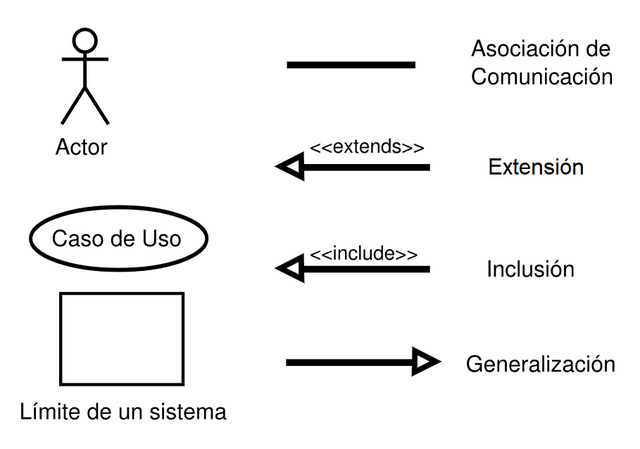

# Ingeniería de Software I - 2025
# Resolución Práctica 3 – Casos de Uso

## Parte I: Definiciones generales

### a) Desarrollo centrado en el usuario
El desarrollo centrado en el usuario es un enfoque de diseño y desarrollo de software que pone las necesidades, comportamientos y experiencias del usuario final en el centro del proceso de desarrollo. Se enfoca en entender cómo los usuarios interactúan con el sistema para crear soluciones que satisfagan sus necesidades reales, priorizando la usabilidad y la experiencia del usuario por encima de consideraciones técnicas.

### b) Casos de uso y su utilización
Los casos de uso son una técnica de modelado que representa las funcionalidades del sistema en términos de las interacciones entre los usuarios (actores) y el sistema. Se utilizan para:
- Capturar los requerimientos funcionales del sistema
- Documentar el comportamiento esperado del sistema
- Facilitar la comunicación entre desarrolladores y stakeholders
- servir como base para el diseño, implementación y pruebas del sistema

### c) Actor y Escenario
- **Actor**: Toda entidad externa que interactúa directamente con el sistema. Puede ser una persona, otro sistema, o un dispositivo. Los actores no forman parte del sistema sino que lo utilizan.
- **Escenario**: Descripción detallada y paso a paso de cómo se ejecuta un caso de uso específico, incluyendo las acciones del actor y las respuestas del sistema.

### d) Relaciones en el diagrama de casos de uso

**Asociación / Uso (-)**: Línea continua que conecta un *actor* con un *caso de uso*, indicando que el actor participa en ese caso de uso.

**Inclusión / Uses (<<include>>)**: Indica que un caso de uso incluye obligatoriamente la funcionalidad de otro caso de uso. Se utiliza para extraer funcionalidades comunes y reutilizables. *Fecha desde quien incluye*

**Extensión (<<extend>>)**: Indica que un caso de uso puede extender a otro bajo ciertas condiciones específicas (implicito). Se utiliza para funcionalidades opcionales o condicionales. *Flecha hacia quien extiende*

**Herencia / Generalización (->)**: Indica una relación de especialización entre actores o entre casos de uso, donde uno es una versión más específica del otro.



### e) Beneficios de modelar requerimientos con casos de uso

1. **Comunicación clara**: Facilita la comunicación entre desarrolladores, analistas y usuarios
2. **Enfoque en el usuario**: Mantiene el foco en las necesidades reales del usuario
3. **Organización sistemática**: Estructura las funcionalidades de manera comprensible
4. **Base para pruebas**: Los escenarios sirven como casos de prueba
5. **Documentación**: Proporciona documentación clara de requerimientos
6. **Validación**: Permite validar requerimientos con stakeholders
7. **Planificación**: Ayuda en estimación de esfuerzos y planificación
8. **Trazabilidad**: Facilita seguimiento desde requerimientos hasta implementación

## Parte II: Ejercitación

### 1. Alquiler de mobiliario

#### Actores identificados:
- **Encargado de mobiliario**: Persona que da de alta el mobiliario
- **Cliente**: Persona que realiza reservas de alquiler
- **Servidor del banco**: Sistema externo para validación de pagos

#### Casos de uso identificados:
- Autenticar usuario
- Dar de alta mobiliario
- Realizar reserva de alquiler
- Procesar pago con tarjeta

#### Diagrama de casos de uso:
```
[Encargado de mobiliario] ---- (Autenticar usuario)
[Encargado de mobiliario] ---- (Dar de alta mobiliario)
[Cliente] ---- (Realizar reserva de alquiler)
[Cliente] ---- (Procesar pago con tarjeta)
[Servidor del banco] ---- (Procesar pago con tarjeta)

(Realizar reserva de alquiler) <<include>> (Procesar pago con tarjeta)
```

#### Escenario: Dar de alta mobiliario

**Nombre del caso de uso**: Dar de alta mobiliario
**Descripción**: Este caso de uso describe el proceso mediante el cual el encargado registra nuevo mobiliario en el sistema.
**Actores**: Encargado de mobiliario
**Precondiciones**: El encargado debe estar autenticado en el sistema.

**Curso Normal**:
| Acciones del Actor | Acciones del Sistema |
|-------------------|---------------------|
| Paso 1: El encargado selecciona la opción "Dar de alta mobiliario" | Paso 2: El sistema solicita código de inventario, tipo de mueble, fecha de creación, fecha de último mantenimiento, estado y precio de alquiler |
| Paso 3: El encargado ingresa todos los datos solicitados | Paso 4: El sistema verifica que el código de inventario no esté repetido |
| | Paso 5: El sistema valida que el precio esté expresado en dólares |
| | Paso 6: El sistema registra el nuevo mobiliario |
| | Paso 7: El sistema confirma el alta exitosa |

**Curso Alterno**: 
Paso alternativo 4: El código de inventario ya existe. Se informa el error y se solicita ingresar un código diferente. Retoma en paso 3.

**Postcondición**: El mobiliario queda registrado en el sistema y disponible para alquiler.

#### Escenario: Realizar reserva de alquiler

**Nombre del caso de uso**: Realizar reserva de alquiler
**Descripción**: Permite a un cliente realizar una reserva de alquiler de mobiliario.
**Actores**: Cliente
**Precondiciones**: Debe haber al menos 3 muebles disponibles en el sistema.

**Curso Normal**:
| Acciones del Actor | Acciones del Sistema |
|-------------------|---------------------|
| Paso 1: El cliente selecciona la opción "Realizar reserva" | Paso 2: El sistema solicita fecha, lugar del evento y cantidad de días |
| Paso 3: El cliente ingresa los datos solicitados | Paso 4: El sistema muestra el listado de mobiliario disponible |
| Paso 5: El cliente selecciona los muebles y cantidades deseadas | Paso 6: El sistema verifica que se hayan seleccionado al menos 3 muebles |
| | Paso 7: El sistema calcula el total del alquiler |
| | Paso 8: El sistema ejecuta el caso de uso "Procesar pago con tarjeta" |
| | Paso 9: El sistema genera un número de reserva único |
| | Paso 10: El sistema registra la reserva y confirma la operación |

**Curso Alterno**: 
Paso alternativo 6: Se seleccionaron menos de 3 muebles. Se informa el error y se solicita seleccionar al menos 3 muebles. Retoma en paso 5.
Paso alternativo 8: El pago no se procesa correctamente. Se cancela la reserva. Fin del caso de uso.

**Postcondición**: La reserva queda registrada en el sistema con un número único asignado.

### 2. Posgrado

#### Actores identificados:
- **Empleado administrativo**: Carga las carreras
- **Alumno**: Se registra e inscribe a carreras
- **Servidor del banco**: Sistema externo para validación de pagos

#### Casos de uso identificados:
- Cargar carrera
- Registrar alumno
- Iniciar sesión
- Inscribirse a carrera
- Procesar pago con tarjeta
- Imprimir comprobantes

#### Escenario: Registrar alumno

**Nombre del caso de uso**: Registrar alumno
**Descripción**: Permite a una persona registrarse como alumno en el sistema.
**Actores**: Alumno
**Precondiciones**: ---

**Curso Normal**:
| Acciones del Actor | Acciones del Sistema |
|-------------------|---------------------|
| Paso 1: El alumno selecciona la opción "Registrarse" | Paso 2: El sistema solicita nombre, apellido, nombre de usuario y contraseña |
| Paso 3: El alumno ingresa todos los datos | Paso 4: El sistema verifica que el nombre de usuario sea único |
| | Paso 5: El sistema valida que la contraseña tenga más de 6 dígitos |
| | Paso 6: El sistema registra al nuevo alumno |
| | Paso 7: El sistema confirma el registro exitoso |

**Curso Alterno**: 
Paso alternativo 4: El nombre de usuario ya existe. Se informa el error y se solicita otro nombre de usuario. Retoma en paso 3.
Paso alternativo 5: La contraseña tiene 6 dígitos o menos. Se informa el error y se solicita una contraseña válida. Retoma en paso 3.

**Postcondición**: El alumno queda registrado en el sistema.

#### Escenario: Inscribirse a carrera

**Nombre del caso de uso**: Inscribirse a carrera
**Descripción**: Permite a un alumno registrado inscribirse a una carrera de posgrado.
**Actores**: Alumno, Servidor del banco
**Precondiciones**: El alumno debe tener una sesión iniciada.

**Curso Normal**:
| Acciones del Actor | Acciones del Sistema |
|-------------------|---------------------|
| Paso 1: El alumno selecciona "Inscribirse a carrera" | Paso 2: El sistema muestra el listado de carreras disponibles |
| Paso 3: El alumno selecciona una carrera | Paso 4: El sistema muestra los detalles de la carrera y solicita cantidad de cuotas |
| Paso 5: El alumno ingresa la cantidad de cuotas deseada | Paso 6: El sistema verifica que la cantidad no supere el máximo permitido |
| Paso 7: El alumno ingresa el número de tarjeta de crédito | Paso 8: El sistema ejecuta el caso de uso "Procesar pago con tarjeta" |
| | Paso 9: El sistema registra la inscripción |
| | Paso 10: El sistema ejecuta "Imprimir comprobantes" |

**Curso Alterno**: 
Paso alternativo 6: La cantidad de cuotas supera el máximo. Se informa el error y se solicita una cantidad válida. Retoma en paso 5.
Paso alternativo 8: El pago falla. Se cancela la inscripción. Fin del caso de uso.

**Postcondición**: El alumno queda inscripto en la carrera seleccionada y se emiten los comprobantes correspondientes.

### 3. Contratos

#### Actores identificados:
- **Empleado de mesa de entradas**: Confecciona minutas
- **Empleado de rendiciones**: Aprueba minutas e imprime listados
- **Servidor AFIP**: Valida habilitación de CUIT
- **Jefe de departamento**: Recibe listados (actor secundario)

#### Casos de uso identificados:
- Confeccionar minuta
- Aprobar minuta
- Validar CUIT en AFIP
- Imprimir listado de personal contratado

#### Escenario: Confeccionar minuta

**Nombre del caso de uso**: Confeccionar minuta
**Descripción**: Permite al empleado de mesa de entradas crear una nueva minuta de contrato.
**Actores**: Empleado de mesa de entradas
**Precondiciones**: ---

**Curso Normal**:
| Acciones del Actor | Acciones del Sistema |
|-------------------|---------------------|
| Paso 1: El empleado selecciona "Confeccionar minuta" | Paso 2: El sistema solicita nombre, CUIT, tipo de contrato, fecha de comienzo, duración y monto |
| Paso 3: El empleado ingresa todos los datos | Paso 4: El sistema valida que el monto no supere $25.000 |
| | Paso 5: El sistema valida que la duración no supere 6 meses |
| | Paso 6: El sistema asigna automáticamente un número de minuta |
| | Paso 7: El sistema registra la minuta con estado "Pendiente" |
| | Paso 8: El sistema confirma la creación de la minuta |

**Curso Alterno**: 
Paso alternativo 4: El monto supera $25.000. Se informa el error y se solicita un monto válido. Retoma en paso 3.
Paso alternativo 5: La duración supera 6 meses. Se informa el error y se solicita una duración válida. Retoma en paso 3.

**Postcondición**: La minuta queda registrada en estado pendiente de aprobación.

#### Escenario: Aprobar minuta

**Nombre del caso de uso**: Aprobar minuta
**Descripción**: Permite al empleado de rendiciones aprobar una minuta previamente confeccionada.
**Actores**: Empleado de rendiciones, Servidor AFIP
**Precondiciones**: Debe existir al menos una minuta en estado pendiente.

**Curso Normal**:
| Acciones del Actor | Acciones del Sistema |
|-------------------|---------------------|
| Paso 1: El empleado selecciona "Aprobar minuta" | Paso 2: El sistema solicita el número de minuta |
| Paso 3: El empleado ingresa el número de minuta | Paso 4: El sistema muestra los datos de la minuta |
| | Paso 5: El sistema verifica que la persona no tenga 3 contratos vigentes |
| | Paso 6: El sistema ejecuta "Validar CUIT en AFIP" |
| Paso 7: El empleado confirma la aprobación | Paso 8: El sistema cambia el estado de la minuta a "Aprobada" |
| | Paso 9: El sistema registra la fecha de aprobación |
| | Paso 10: El sistema confirma la aprobación |

**Curso Alterno**: 
Paso alternativo 4: El número de minuta no existe. Se informa el error y se solicita un número válido. Retoma en paso 3.
Paso alternativo 5: La persona ya tiene 3 contratos vigentes. Se informa y no se permite la aprobación. Fin del caso de uso.
Paso alternativo 6: El CUIT está inhabilitado. Se informa y no se permite la aprobación. Fin del caso de uso.

**Postcondición**: La minuta queda aprobada y representa un contrato vigente.

### 4. Máquina de reciclado

#### Actores identificados:
- **Persona**: Usuario que deposita materiales para reciclar
- **Operador**: Administra la máquina y actualiza configuraciones

#### Casos de uso identificados:
- Reciclar material
- Generar listado de materiales
- Actualizar monto por material

#### Escenario: Reciclar material

**Nombre del caso de uso**: Reciclar material
**Descripción**: Permite a una persona reciclar materiales y obtener el pago correspondiente.
**Actores**: Persona
**Precondiciones**: La máquina debe estar operativa.

**Curso Normal**:
| Acciones del Actor | Acciones del Sistema |
|-------------------|---------------------|
| Paso 1: La persona deposita el material en el recipiente | Paso 2: El sistema detecta automáticamente el tipo de material |
| Paso 3: La persona presiona el botón "reciclar" | Paso 4: El sistema registra el peso del material |
| | Paso 5: El sistema calcula el monto a pagar según el peso y tipo |
| | Paso 6: El sistema imprime un recibo con el monto total |

**Curso Alterno**: 
Paso alternativo 2: El sistema no puede detectar correctamente el tipo de material. El sistema aborta el proceso y retorna el producto. Fin del caso de uso.

**Postcondición**: El material fue reciclado y se emitió el recibo de pago correspondiente.

#### Escenario: Actualizar monto por material

**Nombre del caso de uso**: Actualizar monto por material
**Descripción**: Permite al operador modificar los montos a pagar por cada tipo de material.
**Actores**: Operador
**Precondiciones**: El operador debe tener acceso a la consola bajo llave.

**Curso Normal**:
| Acciones del Actor | Acciones del Sistema |
|-------------------|---------------------|
| Paso 1: El operador accede a la consola y selecciona "Actualizar montos" | Paso 2: El sistema solicita el tipo de material a actualizar |
| Paso 3: El operador selecciona el tipo de material | Paso 4: El sistema muestra el monto actual y solicita el nuevo monto |
| Paso 5: El operador ingresa el nuevo monto | Paso 6: El sistema solicita confirmación de la actualización |
| Paso 7: El operador confirma la actualización | Paso 8: El sistema actualiza el monto para el material seleccionado |
| | Paso 9: El sistema confirma la actualización exitosa |

**Curso Alterno**: 
Paso alternativo 7: El operador cancela la operación. El sistema no actualiza el monto. Fin del caso de uso.

**Postcondición**: El monto del material seleccionado queda actualizado en el sistema.

### 5. Impresión de Fotos

#### Actores identificados:
- **Cliente**: Sube fotos y paga por internet
- **Empleado**: Entrega las fotos en el local
- **Sistema del banco**: Valida pagos con tarjeta

#### Casos de uso identificados:
- Registrar cliente
- Autenticar cliente
- Subir fotos
- Procesar pago
- Retirar fotos

#### Escenario: Subir fotos

**Nombre del caso de uso**: Subir fotos
**Descripción**: Permite a un cliente autenticado subir fotos para ser impresas.
**Actores**: Cliente, Sistema del banco
**Precondiciones**: El cliente debe estar autenticado en el sistema.

**Curso Normal**:
| Acciones del Actor | Acciones del Sistema |
|-------------------|---------------------|
| Paso 1: El cliente selecciona "Subir fotos" | Paso 2: El sistema muestra la interfaz de carga |
| Paso 3: El cliente selecciona y sube fotos una por una | Paso 4: El sistema verifica que no se superen las 50 fotos |
| Paso 5: El cliente confirma la carga de fotos | Paso 6: El sistema calcula el monto total ($15 por foto) |
| | Paso 7: El sistema solicita los datos de la tarjeta de crédito |
| Paso 8: El cliente ingresa número, código y nombre del titular | Paso 9: El sistema ejecuta "Procesar pago" |
| | Paso 10: El sistema genera un código único de retiro |
| | Paso 11: El sistema muestra el código al cliente |

**Curso Alterno**: 
Paso alternativo 4: Se intenta subir más de 50 fotos. Se informa el límite y se impide la carga adicional. Retoma en paso 3.
Paso alternativo 9: El pago falla. Se cancela el pedido. Fin del caso de uso.

**Postcondición**: Las fotos quedan registradas para impresión y se asigna un código único de retiro.

### 6. Ventas de Entradas para Teatro

#### Actores identificados:
- **Cliente**: Compra entradas vía web
- **Empleado**: Realiza operaciones presenciales
- **Vendedor**: Vende entradas en boletería
- **Sistema del banco**: Procesa pagos
- **Administrador**: Gestiona programación

#### Casos de uso identificados:
- Reservar entradas
- Comprar entrada web
- Comprar entrada presencial
- Retirar entradas reservadas
- Retirar entradas compradas
- Administrar programación

#### Escenario: Comprar entrada web

**Nombre del caso de uso**: Comprar entrada web
**Descripción**: Permite a un cliente comprar entradas a través de la página web.
**Actores**: Cliente, Sistema del banco
**Precondiciones**: Debe haber funciones programadas disponibles.

**Curso Normal**:
| Acciones del Actor | Acciones del Sistema |
|-------------------|---------------------|
| Paso 1: El cliente accede a la página de compras | Paso 2: El sistema muestra la grilla de funciones disponibles |
| Paso 3: El cliente selecciona una función | Paso 4: El sistema solicita DNI y cantidad de lugares |
| Paso 5: El cliente ingresa DNI y cantidad solicitada | Paso 6: El sistema verifica disponibilidad de lugares |
| Paso 7: El cliente selecciona "pagar" | Paso 8: El sistema solicita datos de tarjeta de crédito |
| Paso 9: El cliente ingresa número, vencimiento y código | Paso 10: El sistema procesa el pago con el banco |
| | Paso 11: El sistema genera un código de compra |
| | Paso 12: El sistema muestra el código al cliente |

**Curso Alterno**: 
Paso alternativo 6: No hay lugares disponibles. Se informa y se permite seleccionar otra función. Retorna al paso 2.
Paso alternativo 10: El pago es rechazado. Se informa el error. Fin del caso de uso.

**Postcondición**: La compra queda registrada y se asigna un código para retirar las entradas.